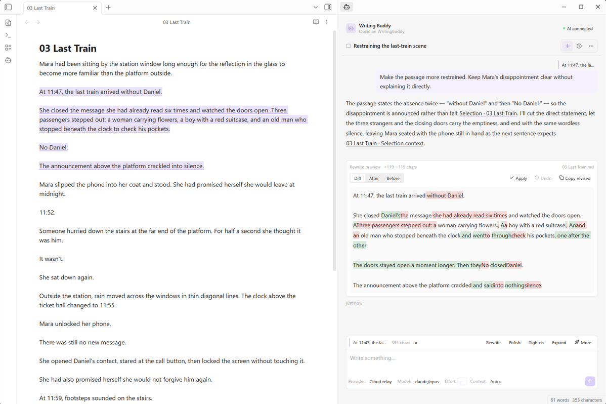
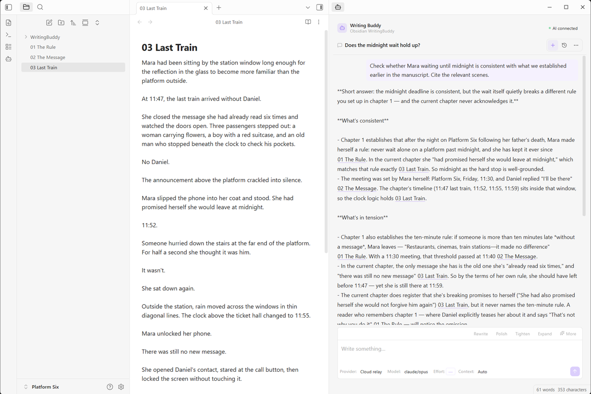
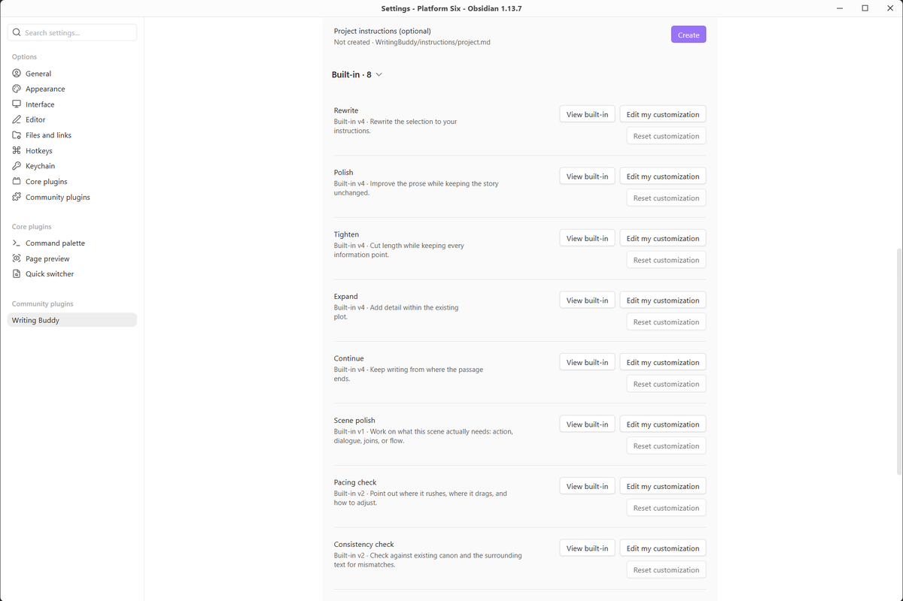

<div align="center">

# Writing Buddy

**A writing partner for your long-form work in Obsidian. Explore the manuscript. Review the rewrite. Keep the final say.**

English | [简体中文](README.zh-CN.md)

[](#quick-start)
[](#requirements)
[](#privacy-and-your-data)
[](LICENSE)

</div>

Writing Buddy brings AI into your writing workspace: ask about a passage, work through a scene, or check whether a character's choices fit the chapters that came before.

Bring your own model. Every generated edit stays a candidate until you choose **Apply**.



<p align="center"><em>From selection to suggestion to review, without leaving the manuscript.</em></p>

<p align="center">
<a href="https://github.com/onezeroooo/obsidian-writing-buddy/stargazers"></a>
&nbsp;&nbsp;
<a href="https://ko-fi.com/onezeroooo"></a>
</p>

<p align="center"><sub>Writing Buddy is free and open source. <a href="https://community.obsidian.md/plugins/writing-buddy">View it on Obsidian Community</a>. If it helps your writing, <a href="https://github.com/onezeroooo/obsidian-writing-buddy/stargazers">give it a star on GitHub</a> or <a href="https://ko-fi.com/onezeroooo">support its upkeep on Ko-fi</a>. Both are entirely optional.</sub></p>

## Built for long-form writing

| | |
|---|---|
| **Work from the manuscript** | Select text, ask a question, rewrite a passage, or continue writing without leaving Obsidian. |
| **Think beyond one selection** | Stay local, let Writing Buddy research more of the manuscript, or use full manuscript coverage when the task requires it. |
| **Review before anything changes** | Writing actions produce candidates and diffs first. The manuscript changes only after you choose Apply. |
| **Start with a writing task** | Built-in Skills cover rewriting, polishing, tightening, expanding, continuing, scene polish, pacing checks, and consistency checks. |
| **Make it yours** | Add project instructions, customize built-in Skills, create your own Skills, and choose model effort and context per conversation. |

## Context that matches the task

Writing Buddy separates manuscript context from the model's own reasoning effort.

| Context | What the AI can work with |
|---|---|
| **Auto** | Writing Buddy decides what the task needs. It can stay local, research more of the manuscript within a controlled budget, or use complete manuscript coverage when correctness depends on it. |
| **Full** | The complete eligible manuscript. |
| **Low** | The selection, nearby context, and the active note only. Other files are not included. |

Writing Buddy selects and reads eligible content. Connections receive the supplied text and citation context; they cannot browse your filesystem. Full coverage applies to the eligible manuscript, and incomplete results are labelled as such.



*A question about one scene, checked against the chapters that establish it.*

## Writing Skills

Writing Buddy includes eight writing-focused Skills:

| Skill | Purpose |
|---|---|
| **Rewrite** | Rewrite a selected passage while preserving its role in the scene. |
| **Polish** | Improve clarity, rhythm, and expression. |
| **Tighten** | Tighten prose without losing important content. |
| **Expand** | Develop a passage with useful detail. |
| **Continue** | Continue from the selected passage in context. |
| **Scene Polish** | Improve dialogue, transitions, scene flow, and showing versus telling where needed. |
| **Pacing check** | Diagnose where a passage loses momentum and explain why. |
| **Consistency check** | Check characters, continuity, setup, payoff, and other project-level facts against manuscript evidence. |



Add your preferences to the built-in Skills, or create your own. Your customizations live in the Vault with the writing project and stay separate from built-in updates.

Project instructions apply across the manuscript, so recurring preferences do not have to be repeated in every conversation. See [Writing Skills](docs/SKILLS.md).

## Your AI, your choice

Writing Buddy has no account and no bundled model. Add one or more AI Connections and choose the one each conversation should use.

Hosted providers may require their own account, API key, and paid usage. Those charges are separate from this free plugin. Local models are supported through Ollama or a compatible endpoint.

Supported options include OpenAI, Anthropic, Google, DeepSeek, OpenRouter, Mistral, Groq, Cerebras, Together AI, Fireworks AI, Perplexity, Hugging Face, SiliconFlow, Ollama, and custom OpenAI-compatible endpoints.

A conversation can independently choose its Connection, Provider, Model, Effort, and Context. Writing Buddy never silently switches to another connection when the one you selected is unavailable.

See [AI Connections](docs/AI_CONNECTIONS.md) for setup and provider details.

## You stay in control of the text

Ask never edits the manuscript.

Rewrite and Continue return candidates first. Applying a change is a local operation inside Obsidian. If the source text changes while a result is being generated, Writing Buddy refuses to paste the result over the new text. Undo is also guarded and only restores the original range when it is still safe to do so.

For Chinese prose, rewrite review uses character-level diff so small wording changes remain easy to inspect.

## English and Chinese

The interface can follow Obsidian, or use English or Chinese explicitly. The instruction language defaults to the interface language and can be set separately for your project. See the [Chinese walkthrough](README.zh-CN.md) for a real Chinese manuscript, rewrite review, and consistency check.

## Privacy and your data

- **No Writing Buddy account.** You connect your own provider or endpoint, under its own terms.
- **Your project data stays in the Vault.** Conversations, project instructions, and Skills are ordinary files under `WritingBuddy/`.
- **Credentials stay on this device.** API keys and connection credentials are not written into synced Vault files.
- **No telemetry or analytics.**
- **What leaves the Vault:** when you send a turn, Writing Buddy sends the selected text, applicable instructions, relevant conversation history, and the context assembled for that request to the selected connection. Connection checks and model discovery can also contact configured endpoints; they do not send your manuscript.
- **Security reports:** see [SECURITY.md](SECURITY.md) for the private reporting path.

The provider or endpoint you choose has its own privacy and data policies.

## Quick Start

Writing Buddy is published in the [Obsidian Community directory](https://community.obsidian.md/plugins/writing-buddy). If it has not appeared in in-app search yet, the directory index may still be propagating. The [GitHub release](https://github.com/onezeroooo/obsidian-writing-buddy/releases/tag/0.1.2) contains the same plugin files and release notes.

1. Open **Settings → Community plugins → Browse** in Obsidian.
2. Search for **Writing Buddy** and install it.
3. Enable Writing Buddy under installed Community plugins.
4. Add an AI connection under **Settings → Writing Buddy → AI Connections**.
5. Open a note and start from the manuscript.

Once the listing appears in your client, future updates arrive through Community plugins.

After setup, select a passage and try: *“Make this more restrained. Keep the disappointment clear without explaining it directly.”* Review the differences, then apply the version you want to keep.

## Requirements

Obsidian 1.8.7 or later, on desktop or mobile.

On mobile, the selected provider or endpoint must be reachable from the device. A model server listening only on another machine's loopback address cannot be reached from a phone or tablet.


*Rewrite review in a narrow layout.*

## Source and development

Writing Buddy is open source under the MIT license. This public repository contains the product source for each released version, the files needed to build it, user documentation, and the distributed plugin artifacts.

To build from source, use Node.js 20.19 or later and run:

```sh
npm ci
npm run build
npm run smoke
```

Found a problem or have a suggestion? [Open an issue](https://github.com/onezeroooo/obsidian-writing-buddy/issues) with the plugin version and steps to reproduce. Please leave API keys and private manuscript text out of public reports.

## License

MIT. See [LICENSE](LICENSE) and [THIRD_PARTY_NOTICES.md](THIRD_PARTY_NOTICES.md).
