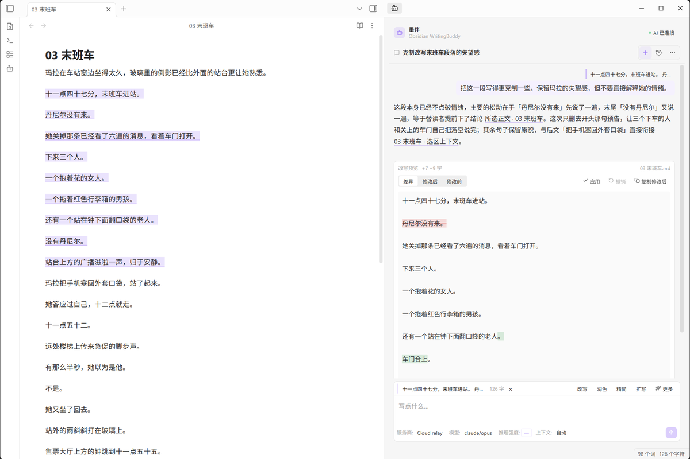
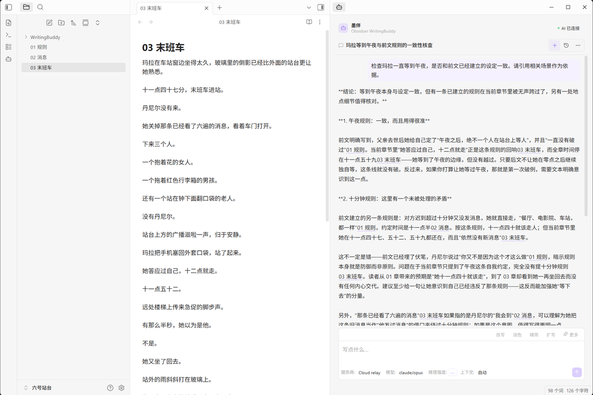
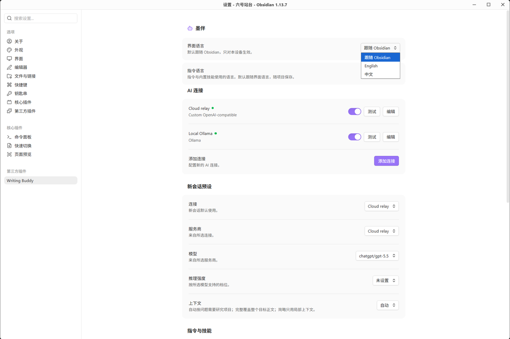
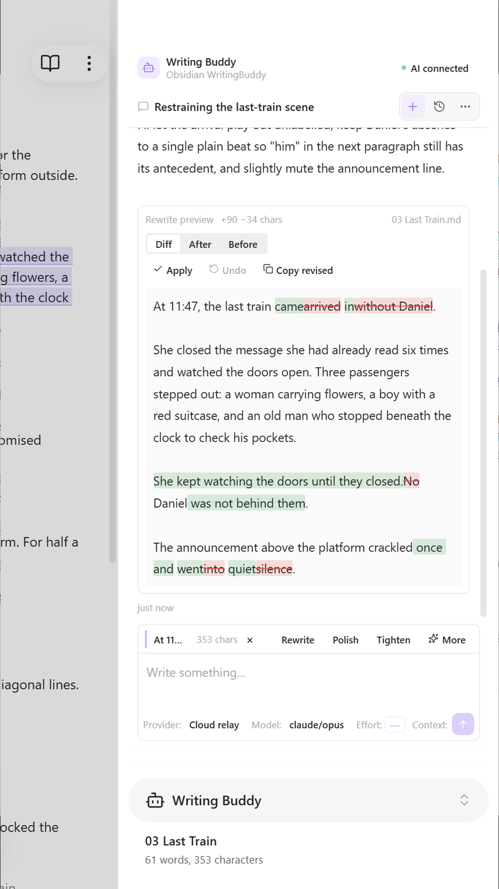

<div align="center">

# 墨伴 · Writing Buddy

**在 Obsidian 里，陪你打磨长篇。结合前文讨论，逐处审阅改写，最后由你定稿。**

[English](README.md) | 简体中文

[](#快速开始)
[](#要求)
[](#隐私与你的数据)
[](LICENSE)

</div>

墨伴是在 Obsidian 里为长篇写作准备的 AI 工作区。

围绕一段正文提问，给场景换一种表达，或回到前几章核对人物的选择。模型由你选，改动先给你看；只有点击**应用**，候选结果才会写回稿件。



*选中正文，说明想怎么改，再决定留下哪些变化。*

如果墨伴帮到了你的写作，欢迎[在 GitHub 点一颗 Star](https://github.com/onezeroooo/obsidian-writing-buddy)。也可以[在 Ko-fi 请我喝杯咖啡](https://ko-fi.com/onezeroooo)，支持后续维护。支持完全自愿，插件所有功能均免费使用。

## 为长篇写作而设计

| | |
|---|---|
| **从正文开始** | 选中一段直接提问、改写、润色或续写，不需要把内容复制到另一个聊天窗口。 |
| **不只看眼前这一段** | 可以只使用局部上下文，也可以让墨伴继续研究稿件；任务需要完整信息时，还可以使用整部稿件。 |
| **改之前先给你看** | 写作动作先生成候选结果和 diff。只有你选择应用之后，正文才会改变。 |
| **按写作任务展开** | 内置改写、润色、精简、扩写、续写、场景打磨、节奏诊断和一致性检查等写作工作流。 |
| **记住你的写作偏好** | 添加项目指令、自定义技能，并为每个对话选择模型、思考强度和上下文模式。 |

## 上下文按任务来

墨伴把稿件上下文和模型本身的思考强度分开控制。

| 上下文 | AI 可以使用什么 |
|---|---|
| **Auto** | 墨伴根据任务决定需要多少上下文。可以只使用当前附近内容，也可以在受控预算内继续研究稿件；任务确实依赖完整信息时，可以使用整部稿件。 |
| **Full** | 当前项目中符合条件的整部稿件。 |
| **Low** | 只使用选区、附近上下文和当前笔记，不读取其他文件。 |

墨伴负责筛选和读取符合条件的稿件。AI 连接收到本轮提供的文本和引用信息，不能自行浏览文件系统。完整覆盖以符合条件的稿件为范围；无法完成覆盖时，结果会明确标注。



*检查设定时，把相关场景一起摆出来，方便你回到原文核对。*

## 写作技能

墨伴内置八个面向真实写作任务的技能：

| 技能 | 用途 |
|---|---|
| **改写** | 在保留场景作用的前提下重新表达选中内容。 |
| **润色** | 改善表达、节奏和可读性。 |
| **精简** | 去掉冗余，同时保留重要信息。 |
| **扩写** | 在需要的位置补充有效细节。 |
| **续写** | 根据当前段落和上下文继续写下去。 |
| **场景打磨** | 根据实际问题处理对白、转场、场景流动和叙述方式。 |
| **节奏诊断** | 找出节奏松掉的位置，并说明原因。 |
| **一致性检查** | 根据稿件证据检查人物、连续性、铺垫、回收和其他项目级信息。 |

内置技能本身保持只读，但你可以在上面添加自己的额外要求。也可以创建完全属于自己的技能，并和项目一起保存在 Vault 中。

项目指令可以保存整部作品都适用的风格、设定或写作原则，不需要在每轮对话里重复。详见[写作技能](docs/SKILLS.zh-CN.md)。

## AI 由你选

墨伴没有自己的账号，也不绑定某一种模型。你可以添加多个 AI Connections，并让每个对话独立选择使用哪一个。

云端服务商可能需要单独的账号、API 密钥和使用费用，这些费用与免费插件本身无关。也可以通过 Ollama 或兼容端点连接本地模型。

支持 OpenAI、Anthropic、Google、DeepSeek、OpenRouter、Mistral、Groq、Cerebras、Together AI、Fireworks AI、Perplexity、Hugging Face、SiliconFlow、Ollama，以及自定义 OpenAI 兼容端点。

每个对话都可以独立选择连接、服务商、模型、推理强度和上下文。如果所选连接失效，墨伴会提示你重新选择。

连接方式和服务商细节见 [AI Connections](docs/AI_CONNECTIONS.md)。

## 正文始终由你掌控

普通提问不会修改稿件。

改写和续写也只会先返回候选结果。真正写回正文的操作发生在 Obsidian 本地。如果 AI 生成期间原文已经被你修改，墨伴会拒绝把旧结果强行贴到新的正文上。撤销操作同样会检查原位置是否仍然安全。

中文改写使用逐字级 diff，小范围措辞变化也能直接看出来。

## 中英文都顺手

界面语言可以跟随 Obsidian，也可以单独选择 English 或中文。指令语言默认跟随界面，也能按项目独立设置，用来决定给模型的指令和内置技能使用哪种语言。



## 隐私与你的数据

- **不需要墨伴账号。** 服务商和模型由你自己选择，并遵循它们各自的条款。
- **项目数据留在 Vault。** 对话、项目指令和技能都以普通文件形式保存在 `WritingBuddy/` 下。
- **凭据只保存在当前设备。** API 密钥和连接凭据不会写入会同步的 Vault 文件。
- **没有遥测和分析。**
- **什么会离开 Vault：** 发送一轮请求时，墨伴会把选中的正文、适用的指令、相关对话历史和本轮整理的上下文发送给所选连接。连接检测和模型列表查询也会访问配置的端点，但不发送稿件。
- **报告安全问题：** 私下报告的方式见 [SECURITY.md](SECURITY.md)。

你选择的服务商或端点各自适用自己的隐私和数据政策。

## 快速开始

**目前尚未在社区目录上架。** 以下安装步骤适用于审核通过之后。[GitHub Release](https://github.com/onezeroooo/obsidian-writing-buddy/releases/tag/0.1.1) 已提供本版本的插件文件与更新说明。

1. 在 Obsidian 中打开 **设置 → 第三方插件 → 浏览**。
2. 搜索 **Writing Buddy** 并安装。
3. 在已安装的第三方插件中启用 Writing Buddy。
4. 到 **设置 → 墨伴 → AI 连接** 添加一个连接。
5. 打开一篇稿件，直接从正文开始。

上架后，更新将通过 Obsidian 的第三方插件机制提供。

配置好之后，可以选中一段试试：*“把这一段写得更克制一些。保留失望感，但不要直接解释情绪。”* 查看差异，再决定是否应用。

## 要求

需要 Obsidian 1.4.5 或更高版本，桌面端和移动端都可以使用。

在移动端，所选服务商或端点必须能从当前设备访问。如果模型服务只监听另一台机器自己的回环地址，手机或平板无法连接它。



*窄屏下的改写审阅界面。*

## 源码与开发

Writing Buddy 以 MIT 许可开源。这个公开仓库会保留每个正式发布版本对应的产品源码、构建所需文件、用户文档和实际发布产物。

从源码构建需要 Node.js 20.19 或更高版本：

```sh
npm ci
npm run build
npm run smoke
```

遇到问题或有建议，欢迎[提交 Issue](https://github.com/onezeroooo/obsidian-writing-buddy/issues)，附上插件版本和复现步骤。请勿在公开报告中包含 API 密钥或私人稿件。

## 许可

MIT。见 [LICENSE](LICENSE) 和 [THIRD_PARTY_NOTICES.md](THIRD_PARTY_NOTICES.md)。
